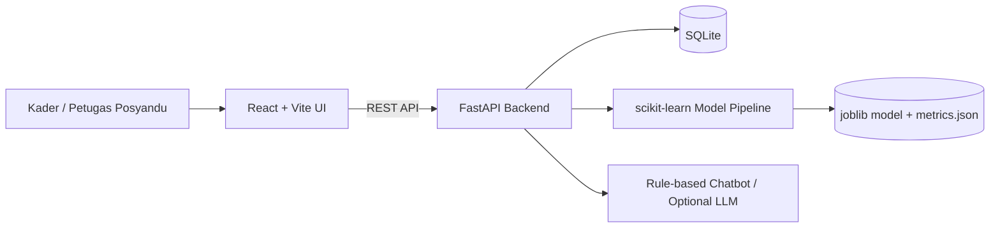

# Architecture

StuntGuard memakai arsitektur monorepo sederhana dengan frontend React dan backend FastAPI.

## Frontend

Frontend bertugas menampilkan halaman dashboard, data balita, detail balita, prediksi cepat, chatbot edukasi, dan info model. Komunikasi API dipusatkan di `frontend/src/services/api.ts`.

## Backend

Backend menyediakan endpoint:

- `GET /health`
- `POST /predict`
- `GET/POST/PUT/DELETE /children`
- `GET/POST /children/{id}/measurements`
- `GET /dashboard/summary`
- `POST /chatbot`
- `GET /model/info`

## Database

SQLite menyimpan dua tabel utama:

- `children`: data balita demo tanpa NIK.
- `measurements`: riwayat pemeriksaan tinggi badan dan hasil prediksi.

Relasi: satu balita memiliki banyak pemeriksaan.

## ML Model

Model disimpan sebagai pipeline joblib. Pipeline menerima fitur:

- `age_month`
- `gender`
- `height_cm`

Output model:

- `severely stunted`
- `stunted`
- `normal`
- `tall`

Jika model belum tersedia atau gagal dimuat, API memakai fallback demo yang ditandai jelas dan confidence bernilai `null`.

## Chatbot

Chatbot memiliki fallback rule-based untuk pertanyaan umum. Jika `OPENAI_API_KEY` tersedia, backend mencoba memakai LLM. Bila gagal, sistem tetap kembali ke rule-based sehingga aplikasi tetap bisa berjalan offline.

## Disclaimer

Semua prediksi dan rekomendasi adalah skrining awal serta edukasi. Diagnosis dan intervensi resmi harus dilakukan oleh tenaga kesehatan atau Puskesmas.
