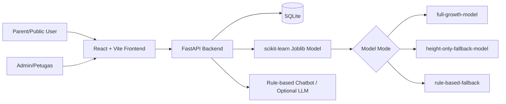

# Architecture

StuntGuard adalah web app publik untuk skrining awal stunting. Pengguna bisa melakukan quick check dari landing page tanpa login. Login hanya diperlukan untuk menyimpan riwayat anak, melihat grafik pertumbuhan, dan membuat consultation ticket.

## Frontend

Frontend menyediakan landing page, quick stunting check, login demo, parent dashboard, admin dashboard, data balita, detail balita, grafik tinggi/berat, chatbot, consultation ticket, dan halaman model info.

## Backend

Backend FastAPI menyediakan endpoint:

- `POST /predict`
- `GET /model/info`
- CRUD children dan measurements
- `GET /dashboard/summary`
- `POST /auth/login`
- Consultation ticket endpoints
- `POST /chatbot`

## Database

SQLite menyimpan data demo anak, pemeriksaan, hasil prediksi, model mode, dan ticket konsultasi.

## ML Model

Model dilatih dengan scikit-learn dan disimpan sebagai joblib. Jika dataset memiliki berat badan, mode aktif adalah `full-growth-model`. Jika tidak, training membuat `height-only-fallback-model` agar demo tetap stabil tanpa memalsukan data berat.

## Chatbot

Chatbot default rule-based. Jika `OPENAI_API_KEY` tersedia, backend bisa memakai LLM opsional. Jawaban selalu bersifat edukatif dan bukan diagnosis.
